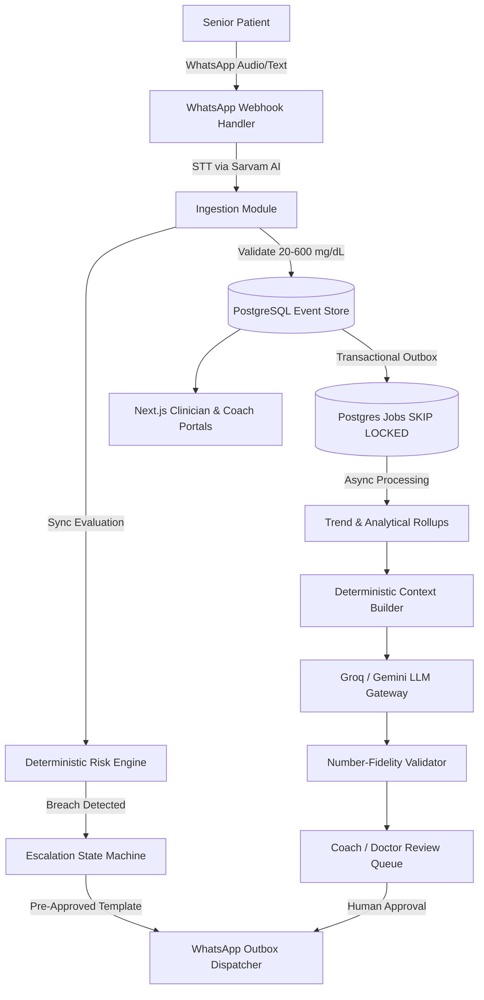

# Diabeto Architecture Specification

## 1. High-Level Architecture
Diabeto is structured as a **FastAPI Modular Monolith** coupled with Supabase PostgreSQL and a Next.js web application.

## 2. Component Separation & Responsibilities
- **API & Channels (`apps/api/app/channels/`):** Webhook intake, cryptographic signature verification, Twilio/Meta payload parsing.
- **Ingestion (`apps/api/app/modules/ingestion/`):** Range validation (20-600 mg/dL), echo confirmation, immutable event write.
- **Risk Engine (`apps/api/app/modules/risk/`):** Synchronous deterministic threshold evaluator (<70, <80, >180, >=250 mg/dL).
- **Adherence (`apps/api/app/modules/adherence/`):** Medication scheduling and dose confirmation.
- **AI Gateway & Guardrails (`apps/api/app/modules/ai_gateway/`):** PII scrubbing, context assembly, JSON schema output enforcement, and number-fidelity checks.
- **Approvals (`apps/api/app/modules/approvals/`):** Human-in-the-loop review queue for coaches and clinicians.
- **Durable Jobs (`apps/api/app/core/jobs.py`):** Transactional outbox using PostgreSQL `FOR UPDATE SKIP LOCKED`.

## 3. Reliability & Safety Rules
1. Zero AI dependency on emergency paths.
2. Every number generated by LLM must strictly exist in the evidence payload.
3. Idempotent webhook processing using provider message IDs (`source_msg_id`).
