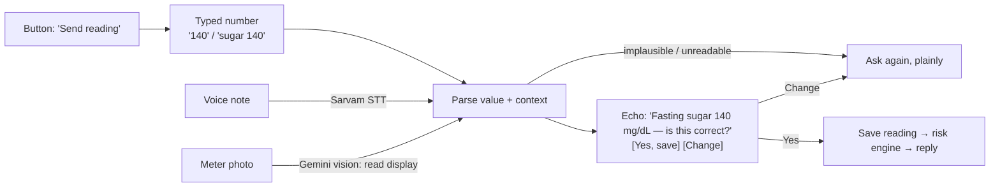
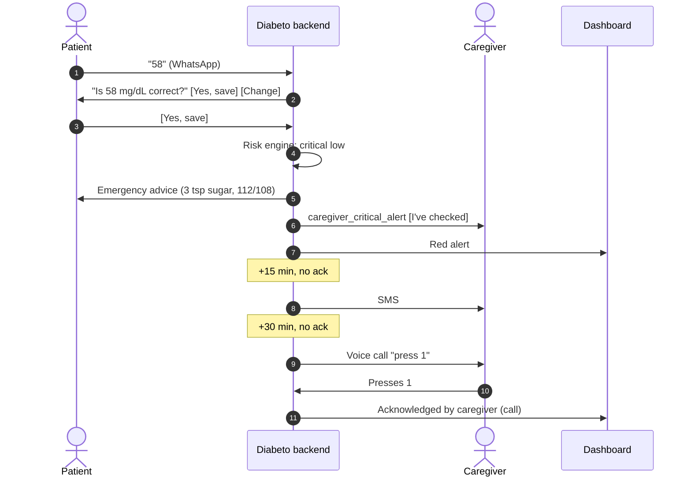

# WhatsApp Integration (Twilio)

WhatsApp is Diabeto's **main channel**. Seniors never install an app: they get reminders, send readings and receive alerts in a chat they already use every day. This document is the single reference for how that works, what it needs, and what still has to be built.

| Decision | Choice |
| --- | --- |
| Provider | **Twilio** — WhatsApp, SMS and voice calls from one vendor |
| Two-way WhatsApp users | **Patients (seniors)** only |
| Caregivers | **One-way WhatsApp alerts** with an "I've checked" button; they don't log readings |
| Doctors & coaches | Web dashboard (not WhatsApp) |
| Patient input | Reply buttons, typed numbers, voice notes, photo of the glucose meter |
| Emergency fallback | WhatsApp → **SMS** → **automated voice call** to the caregiver |
| Stage | **Real pilot soon**, under 20 patients, one clinic |
| Business entity | **None yet** — this blocks the pilot (see §11) |

Related: [`PRD.md`](PRD.md), [`ARCHITECTURE.md`](ARCHITECTURE.md), [`templates/messages.json`](../templates/messages.json), [`DESIGN_RULES.md`](../DESIGN_RULES.md) (copy and tone rules apply to every message).

---

## 1. Who talks to whom

| Person | Channel | Can send | Receives |
| --- | --- | --- | --- |
| Patient | WhatsApp (two-way) | Button taps, numbers, voice notes, meter photos, "HELP", "STOP" | Reminders, reading confirmations, safety messages, approved coach nudges, weekly summary |
| Caregiver | WhatsApp (one-way) + SMS + voice call | Only the **"I've checked"** button (and "STOP") | Critical alerts, missed-dose alerts |
| Coach / doctor | Web dashboard | Approve/edit/reject nudges, verify summaries, acknowledge alerts | Alert queue, "family not reached" flags |
| Emergency services | — | — | **Never contacted automatically.** We tell people to call 112 / 108 |

---

## 2. WhatsApp rules we design around

These come from WhatsApp Business (via Twilio) and shape every flow.

1. **The 24-hour window.** After a patient messages us, we may reply freely for 24 hours. Anything else — a reminder the next morning, every caregiver alert (caregivers never message first) — must be a **pre-approved template**. A free-form message outside the window is rejected by WhatsApp.
2. **Templates need Meta approval**, per language. Ours are all in the **Utility** category (reminders, alerts, confirmations). Keep them free of promotional wording, or Meta may re-classify them as Marketing, which costs more.
3. **Opt-in first.** We may only start conversations with people who agreed to receive WhatsApp messages from us. We record when and how they agreed (§9).
4. **Buttons are limited.** Plan for at most **3 quick-reply buttons** per message and **10 rows** in a list. Button labels are short (about 20 characters).
5. **One-to-one chats only.** No family group chats; patient and caregiver each have their own chat.
6. **A dedicated business number.** It can't be used in the normal WhatsApp app at the same time.
7. **Quality rating and daily limits.** New numbers can message only a limited number of people per day, and users blocking or reporting us lowers the number's quality rating. Under 20 patients fits comfortably, but every message must be wanted.
8. **Costs.** Template messages are charged (Meta's fee plus Twilio's). Replies inside the 24-hour window are cheaper or free. Keep template sends to what's needed.

---

## 3. Patient flows

### 3.1 Onboarding and opt-in
1. At the clinic, the patient (or caregiver on their behalf) signs consent (§11) and the coach adds them in the dashboard with phone, language and medicine schedule.
2. Diabeto sends the **`welcome_opt_in`** template: *"Namaste Ramesh ji, Pune Central Diabetes Clinic has added you to Diabeto…"* with buttons **[Yes, start]** **[No, thanks]**.
3. **Yes** → opt-in recorded; send a short how-to: "Send your sugar number, a voice note, or a photo of your meter."
4. **No**, or no reply in 48 h → no further messages; the coach sees "Not opted in" on the dashboard.

### 3.2 Medicine reminder
1. At the scheduled time, send the **`medication_reminder`** template with **[Taken]** **[Not yet]**.
2. **Taken** → log the dose, reply "Thank you ✅".
3. **Not yet** → reply "Okay, I'll remind you again in 30 minutes." and send one more reminder.
4. No confirmation 60 minutes after the scheduled time → the dose counts as **missed**, and the missed-dose ladder starts (§5).

### 3.3 Logging a sugar reading — four ways in, one way out

Every input path ends in the **same confirmation step**. Nothing is saved until the patient confirms. This matters most for photos and voice, where misreads happen.



| Input | How we read it | Watch out for |
| --- | --- | --- |
| **Typed number** | First 2–3 digit number; Devanagari digits (१४०) converted. | Times in the message ("8 30"). Ask again if more than one candidate number. |
| **Voice note** | Download the audio (Twilio media URL, with auth) → **Sarvam STT** → parse. | Numbers spoken as words ("एक सौ चालीस", "one forty"): needs a number-word parser for hi/mr/en. Keep the transcript with the reading. |
| **Meter photo** | **Gemini vision** with a structured answer: `{kind: "glucometer" \| "meal" \| "other", value, unit, confidence}`. | Never save without confirmation. Low confidence → "I couldn't read it clearly, please type the number." mmol/L meters → convert or ask. Meal photos go to meal analysis instead (§3.6). |
| **Button** | "Send reading" opens a prompt: "Please send the number on your meter." | — |

**Context** (fasting, after breakfast, after dinner…) is guessed from keywords and the time of day, and shown in the confirmation. **[Change]** lets the patient fix the number or pick the context from a list.

**Plausibility:** values outside **20–600 mg/dL** are never saved: "That number looks unusual. Please check your meter and send it again."

### 3.4 After saving: the reply
The deterministic risk engine (`modules/risk/engine.py`, zero AI) decides the reply. Copy comes from `templates/messages.json`.

| Result | Reply to patient | Also |
| --- | --- | --- |
| Normal | "Thank you! Your reading is saved ✅" | — |
| High (≥ high) | Saved + a gentle note | Shown on the dashboard |
| Critical high (≥ critical_high) | `high_glucose_warning` | Care team notified (dashboard) |
| Low / critical low (< low) | `critical_hypo_emergency`: 3 teaspoons of sugar, call 112/108 if dizzy | **Caregiver ladder starts immediately** (§5) |

### 3.5 Coach-approved nudges and the weekly summary
- AI-drafted lifestyle messages are sent **only after a coach or doctor approves** them on the dashboard.
- Approved text is free-form, so it can't be its own template. If the 24-hour window is **open**, send it directly. If it's **closed**, send the **`care_team_message`** template ("Your care team has a message for you. [Read it]"); the tap opens the window, then send the approved text.
- The **weekly summary** goes out only after the doctor clicks **Verify**, as the **`weekly_summary`** template.

### 3.6 Meal photos
The meal-analysis feature (`modules/meal_intelligence`) stays, but routing changes: decide meal vs. meter **from the image itself** (Gemini's `kind`), never from keywords. A message like "after dinner sugar 210" is a glucose reading, not a meal.

### 3.7 Keywords that always work
| Patient sends | Diabeto does |
| --- | --- |
| `HELP` / `मदद` / `मदत` | Short help text + clinic phone number |
| `STOP` | Stops all messages, records opt-out, alerts the coach on the dashboard |
| `START` | Re-subscribes (after a STOP) |
| Anything unclear | "Sorry, I didn't understand. Please send your sugar number, like 140." Never guess. |

### 3.8 Quiet hours
No reminders or nudges between **21:30 and 07:00** (per patient, adjustable). **Critical alerts ignore quiet hours.**

---

## 4. Caregiver flows

1. **Opt-in.** The caregiver gets a **`caregiver_opt_in`** template naming the patient and clinic: **[Yes, alert me]** **[No]**. No alerts go to them until they say yes. Record their language separately from the patient's.
2. **Alerts** are templates with a **[I've checked]** button. The alert text includes the clinic's phone number.
3. **Tapping [I've checked]** sends an inbound message with a button payload like `ack:<risk_event_id>`. The backend marks that alert acknowledged, stops the ladder and replies "Thank you, we've noted it."
4. Caregivers **can't see exact sugar values** unless the patient allowed it (`view_raw_glucose`). Their templates then say "very low", not "58 mg/dL".

---

## 5. Escalation ladder

Timers run on the existing jobs queue (`core/jobs.py`, `core/job_dispatcher.py`). Any acknowledgement — caregiver button, SMS reply, call keypress, or a coach/doctor clicking **Acknowledge** — stops the ladder.

### Critical (sugar below critical low, or at/above critical high)

| Time | Action | Channel |
| --- | --- | --- |
| **0 min** | Emergency message to the patient (`critical_hypo_emergency` / `high_glucose_warning`) | WhatsApp (window is open: they just messaged) |
| **0 min** | **Caregiver alert** (`caregiver_critical_alert`) with [I've checked] | WhatsApp template |
| 0 min | Red alert on the dashboard | Web |
| **On failure** | If the caregiver's WhatsApp status comes back `failed` / `undelivered`, send the SMS **now** instead of waiting | SMS |
| **+15 min**, no ack | SMS to caregiver; dashboard shows "Family not responding" to coach and doctor | SMS + web |
| **+30 min**, no ack | **Automated voice call** to caregiver in their language: "…Press 1 if you have checked on them." | Voice |
| +40 min, no ack | Second call to caregiver, then a call to the patient | Voice |
| +45 min, no ack | Dashboard: **"Not reached — call the family"** for clinic staff | Web |

> The existing code alerts the caregiver only after 15 minutes. For a critical low that's too late: the caregiver is alerted at **0 min**.

### Urgent (missed dose)

| Time after the dose was due | Action |
| --- | --- |
| +30 min | Second reminder to the patient (`medication_reminder`) |
| +60 min | Dose marked missed; caregiver gets `caregiver_missed_dose` with [I've checked] |
| — | No SMS or calls for missed doses |

### Watch (high, not critical)
No caregiver messages. Shown on the dashboard and in trends.



---

## 6. Message catalogue

### 6.1 WhatsApp templates (need Meta approval, en + hi + mr each)

All category **Utility**. Variables shown as `{{name}}`; Twilio's Content API uses numbered variables (`{{1}}`, `{{2}}`), mapped in code.

| Key | To | Purpose | Buttons | Variables |
| --- | --- | --- | --- | --- |
| `welcome_opt_in` | Patient | First contact, ask permission | Yes, start · No, thanks | patient_name, clinic_name |
| `caregiver_opt_in` | Caregiver | Ask permission to send alerts | Yes, alert me · No | caregiver_name, patient_name, clinic_name |
| `medication_reminder` | Patient | Dose reminder | Taken · Not yet | patient_name, time, medication_name, dose |
| `reading_reminder` | Patient | Ask for a reading if none today | Send reading | patient_name |
| `caregiver_critical_alert` | Caregiver | Critical low/high | I've checked | patient_name, level_word (e.g. "very low"), time, clinic_phone |
| `caregiver_missed_dose` | Caregiver | Missed dose | I've checked | patient_name, medication_name, time |
| `care_team_message` | Patient | Opens the window for an approved nudge | Read it | patient_name |
| `weekly_summary` | Patient | Doctor-verified summary | — | patient_name, doctor_name, in_range_pct, doses_taken_pct |

That's **8 templates × 3 languages = 24 approvals**. Submit them early: approval can take from minutes to days, and rejections need rewording.

Template writing rules (Meta's, plus ours):
- Don't start or end the text with a variable; don't put variables next to each other.
- No promotional words ("offer", "free", "best") — they push the template into Marketing.
- Same tone and copy rules as [`DESIGN_RULES.md` §5](../DESIGN_RULES.md): warm, short, tell people what to do, Western digits, units always.
- Teammate 1 owns the Hindi and Marathi copy in `templates/messages.json`.

### 6.2 Session messages (no approval needed; only inside the 24-hour window)
Reading confirmation with [Yes, save] [Change], "saved" replies, `critical_hypo_emergency` and `high_glucose_warning` (sent right after the patient's own message), help text, "didn't understand", approved nudge text. Their copy still lives in `templates/messages.json` so it's translated and reviewed.

### 6.3 SMS (India requires DLT registration of the sender ID and every template)
| Key | To | Text (en; hi/mr versions too) |
| --- | --- | --- |
| `sms_critical_alert` | Caregiver | "Diabeto: {{patient}}'s sugar is {{level_word}}. Please check on them now. Clinic: {{clinic_phone}}. In an emergency call 112." |
| `sms_not_reached` | Caregiver | "Diabeto: we could not reach you about {{patient}}. Please call {{patient}} or the clinic at {{clinic_phone}}." |

### 6.4 Voice call script
Spoken in the caregiver's language (Twilio text-to-speech, or a pre-recorded Sarvam TTS clip):
> "This is Diabeto calling about {{patient}}. Their sugar is {{level_word}}. Please check on them now. If they are dizzy or confused, call 112. Press 1 if you have checked on them. Press 2 to hear this again."

Pressing **1** acknowledges the alert.

---

## 7. Technical design

### 7.1 Endpoints
| Endpoint | Purpose |
| --- | --- |
| `POST /v1/webhooks/whatsapp` | Inbound WhatsApp messages from Twilio (form-encoded) |
| `POST /v1/webhooks/twilio/status` | Delivery status for every outbound message (`queued → sent → delivered → read`, or `failed` / `undelivered` + error code) |
| `POST /v1/webhooks/twilio/voice` | TwiML for the alert call; `<Gather>` collects the "press 1" |
| `POST /v1/webhooks/twilio/voice/gather` | Handles the keypress → acknowledges the alert |
| `POST /v1/webhooks/twilio/sms` | Inbound SMS replies (optional: "OK" acknowledges) |

### 7.2 Inbound processing (`/v1/webhooks/whatsapp`)
1. **Verify the `X-Twilio-Signature` header** (Twilio's `RequestValidator`). Reject anything unsigned. Without this, anyone could post fake readings.
2. **Deduplicate** on `MessageSid` (stored as `source_msg_id`). Twilio retries on timeouts.
3. **Identify the sender** by exact E.164 phone match against patients and caregivers. **Unknown numbers get a polite "this number isn't registered" reply and nothing is stored.**
4. **Return 200 quickly.** Do STT, vision and AI work in a background job, then send the reply through the REST API. Twilio's webhook times out after about 15 seconds; voice and photo processing can be slower.
5. **Route by content:**
   - `ButtonPayload` present (e.g. `dose_taken:<dose_id>`, `confirm_reading:<pending_id>`, `ack:<risk_event_id>`) → handle the action.
   - Media of type `audio/*` → voice flow. Media of type `image/*` → vision classify (meter vs. meal).
   - Text → keywords (HELP/STOP/START), else number parsing.
6. **Conversation state** per patient (e.g. "waiting for reading confirmation: 140, fasting, from voice") lives in a small table with an expiry (about 30 minutes), so a later "yes" or button tap applies to the right reading.

### 7.3 Outbound sending (`channels/twilio_client.py`)
- **Templates:** send with `ContentSid` + `ContentVariables`. Keep a map `template_key + language → ContentSid` in config or a JSON file, created in the Twilio Console (Content Template Builder) and submitted to Meta from there.
- **Session replies:** `Body` text, or a quick-reply content item for buttons.
- Every send sets **`StatusCallback`** to `/v1/webhooks/twilio/status` and is written to the message log (§8) with its Twilio SID.
- Use a **Twilio Messaging Service** so WhatsApp and SMS share one sender pool and settings.
- **Window check:** before a free-form send, check the patient's last inbound time. If it's over 24 hours ago, use the template path.
- Retry once on network errors; never retry a `failed` template blindly — escalate to SMS instead.

### 7.4 Media
- Twilio media URLs (`MediaUrl0`) are fetched with the account's basic auth.
- Don't keep raw audio or photos longer than needed: store the transcript or extracted value plus a short-lived reference, and delete the media after processing (or after 30 days if kept for audit). They are health data.

### 7.5 SMS and voice
- **SMS** via the same Twilio account, with the DLT-registered sender ID and templates (§11).
- **Voice** via Twilio Programmable Voice: `/voice` returns TwiML with `<Say>` (Hindi/Marathi/English voice) or `<Play>` (pre-recorded clip), then `<Gather numDigits="1">`.
- Calls to Indian numbers from Twilio may show an international caller ID. **Test answer rates before the pilot**; keep an Indian voice provider (e.g. Exotel) as a backup.

### 7.6 Configuration (add to `.env.example`)
```bash
TWILIO_ACCOUNT_SID=
TWILIO_AUTH_TOKEN=
TWILIO_MESSAGING_SERVICE_SID=        # shared sender pool for WhatsApp + SMS
TWILIO_WHATSAPP_NUMBER=whatsapp:+91XXXXXXXXXX
TWILIO_SMS_SENDER_ID=                 # DLT-registered header
TWILIO_VOICE_FROM=+XXXXXXXXXXX
PUBLIC_BASE_URL=https://api.example.com   # used to build webhook + status callback URLs
WHATSAPP_CONTENT_SIDS_PATH=templates/twilio_content_sids.json
QUIET_HOURS_START=21:30
QUIET_HOURS_END=07:00
```

---

## 8. Data model additions

| Table / field | Holds |
| --- | --- |
| `patients.whatsapp_opt_in_at`, `whatsapp_opt_in_method`, `whatsapp_opted_out_at` | Consent record |
| `users.whatsapp_opt_in_at`, `language`, `alert_channels` | Same for caregivers, plus which channels they accept |
| `message_log` | id, direction (in/out), person, channel (whatsapp/sms/voice), template_key, twilio_sid, status, error_code, related risk_event_id, created_at, status_updated_at. **No message text for health values beyond what's needed** |
| `conversation_state` | patient_id, state (e.g. `awaiting_reading_confirmation`), payload (value, context, source), expires_at |
| `health_events.value` | Add `source` (`text` / `voice` / `photo` / `button`), `transcript` or `vision_confidence`, `confirmed_at` |
| `risk_events` | Add `acknowledged_by`, `acknowledged_via` (whatsapp_button / sms / call / dashboard), `acknowledged_at`, `ladder_step` |

---

## 9. Consent and privacy

- **Written consent at the clinic** (patient, and caregiver for alerts), explaining: what Diabeto does, that it is **not an emergency service**, that messages go through WhatsApp (Meta) and Twilio, and that the doctor stays responsible for treatment.
- **WhatsApp opt-in** recorded separately (§3.1, §4), with time and method.
- India's **Digital Personal Data Protection Act, 2023**: collect only what's needed, state the purpose, honour withdrawal (STOP), and let people ask for their data to be deleted. Health readings, voice notes and meter photos are sensitive.
- **No names or phone numbers sent to AI models** (STT, vision and LLM calls get IDs or nothing). Gemini receives the image only; Sarvam receives audio only.
- Message logs keep delivery facts, not full message bodies, wherever possible.
- Caregivers see exact values only with the patient's permission.

---

## 10. Current code vs. this design

Reviewed: `apps/api/app/channels/whatsapp.py`, `channels/twilio_client.py`, `modules/risk/escalation.py`, `modules/adherence/scheduler.py`.

| # | Gap | Where | Why it matters | Priority |
| --- | --- | --- | --- | --- |
| 1 | Readings from **unknown numbers are saved to Ramesh's record** (test fallback) | `whatsapp.py` (unknown-patient fallback) | A stranger's message becomes a real patient's reading and can trigger alerts | **Must fix before pilot** |
| 2 | **No `X-Twilio-Signature` check** | `whatsapp.py` | Anyone can post fake readings to the webhook | **Must fix** |
| 3 | **Caregiver alert waits 15 min** even for critical lows | `risk/escalation.py` | Too slow for hypoglycaemia; design alerts the caregiver at 0 min | **Must fix** |
| 4 | **All outbound uses free-form `Body`** | `twilio_client.py`, `escalation.py`, `scheduler.py` | Reminders and every caregiver alert fall outside the 24 h window and **will be rejected by WhatsApp** | **Must fix** |
| 5 | **No confirmation step** — readings are saved immediately, context always "fasting" | `whatsapp.py` | Voice/typing errors become clinical data; PRD requires echo-back | High |
| 6 | **"dinner", "lunch" keywords route to meal analysis** | `whatsapp.py` (meal routing) | "After dinner sugar 210" is treated as a meal, not a reading | High |
| 7 | No **meter-photo reading**; every image goes to meal analysis | `whatsapp.py` | Agreed input method missing | High |
| 8 | No **delivery status callbacks**, no message log | — | Can't detect failed alerts or trigger SMS fallback | High |
| 9 | No **SMS or voice fallback** | — | Agreed emergency ladder missing | High (pilot) |
| 10 | No **button payload handling** (`ButtonPayload`) for Taken / I've checked | `whatsapp.py` | Caregiver acknowledgement and dose confirmation can't work | High |
| 11 | STT, vision and AI run **inside the webhook request** | `whatsapp.py` | Risk of Twilio timeouts and duplicate retries | Medium |
| 12 | Message copy is **hard-coded** in Python with emoji, only en/hi | `whatsapp.py`, `escalation.py` | No Marathi; bypasses `templates/messages.json` and Teammate 1's review | Medium |
| 13 | Number parsing misses **spoken number words** | `whatsapp.py` | Voice notes like "एक सौ चालीस" fail | Medium |
| 14 | No opt-in / STOP handling, no quiet hours | — | Required by WhatsApp policy and consent | Medium (pilot) |

---

## 11. Pilot readiness checklist

### The blocker: a business entity
Meta business verification (for the WhatsApp number, display name and templates) **and** DLT registration for SMS both need a registered business. Options, fastest first:
1. **Run under the partner clinic's business.** The clinic owns the WhatsApp Business account and the DLT registration; the team builds and runs the software for them. This also makes the clinic the clear data controller for consent.
2. **Register a small entity** (e.g. sole proprietorship with Udyam/MSME or GST registration, or a company). Check Meta's and the DLT operator's current lists of accepted documents.
3. **Start unverified** for the first few patients, if Meta's current limits for unverified businesses allow it. Confirm with Twilio before relying on this.

### Accounts and approvals
- [ ] Business entity decided (above)
- [ ] Meta Business Manager created and verified
- [ ] Twilio account upgraded from trial; WhatsApp sender registered with a dedicated Indian number; display name approved
- [ ] 24 WhatsApp templates submitted and approved (§6.1)
- [ ] DLT registration: entity, SMS sender ID (header), 2 SMS templates × 3 languages
- [ ] Voice: test call answer rates to Indian numbers; backup provider identified

### Clinic and people
- [ ] Partner clinic signed up; named doctor responsible for every patient
- [ ] Consent forms (patient + caregiver) in en/hi/mr, reviewed by the clinic
- [ ] Clinic staff know what "Family not reached" on the dashboard means and who calls
- [ ] A clear "Diabeto is not an emergency service" line in onboarding, consent and help text

### Build (from §10)
- [ ] Gaps 1–4 fixed before any real patient is added
- [ ] Gaps 5–10 fixed before the pilot starts
- [ ] Every template and session message in `templates/messages.json`, reviewed by Teammate 1

### Testing
- [ ] Every flow end-to-end on real phones in all three languages
- [ ] Voice notes from older speakers in noisy rooms; meter photos from at least 3 common meter models, in poor light
- [ ] Failure drills: caregiver phone off, WhatsApp blocked, wrong number, Twilio outage — confirm the ladder reaches SMS and the call
- [ ] Load is tiny (< 20 patients), but check duplicate deliveries and retries don't double-log readings

---

## 12. Hackathon demo path

Until the pilot accounts exist:
- Use the **Twilio WhatsApp sandbox**: each demo phone sends the sandbox join code once; sessions expire after a few days, so re-join before the demo. Templates aren't needed inside an open session, so demo flows should start with the patient messaging first.
- Show the **SMS and voice fallback** with a real Twilio call to a team phone (trial accounts can call verified numbers), or on a slide if that's not ready.
- Keep Ramesh/Shanti/Ananya as demo personas; gap 1's fallback can stay **only** in the demo build, behind a flag that's off in production.

---

## 13. Open questions and things to verify

| Question | Owner |
| --- | --- |
| Which business entity runs the WhatsApp number and DLT? | Team + clinic |
| Exact current Meta limits for unverified businesses, and template approval times | Teammate 3 (APIs) |
| Twilio DLT support and process for Indian SMS | Teammate 3 |
| Twilio voice caller ID and answer rates in India; Exotel as backup? | Teammate 3 |
| Caregiver ladder timings (0 / 15 / 30 / 40 min) — does the clinic agree? | Doctor |
| Quiet hours default (21:30–07:00) — right for these patients? | Coach |
| How long to keep voice notes and photos (suggest: delete after processing) | Team + clinic |
| Which glucose meter models the pilot patients use (for photo reading tests) | Clinic |
